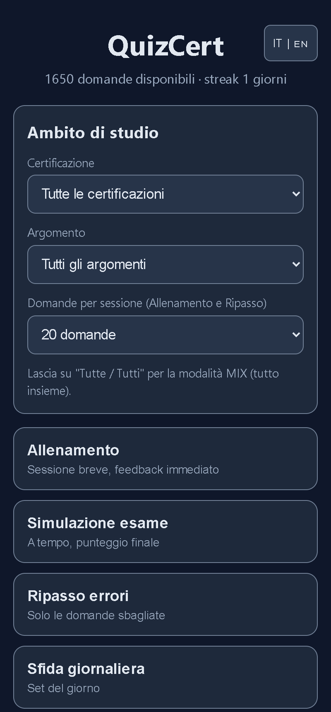
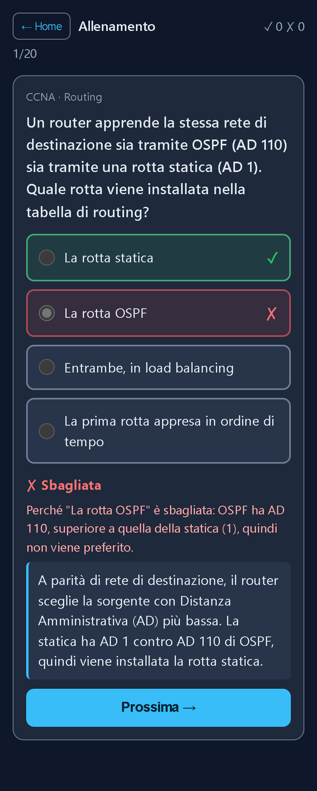
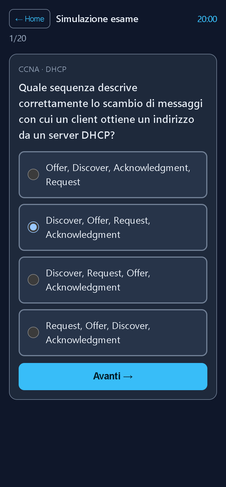
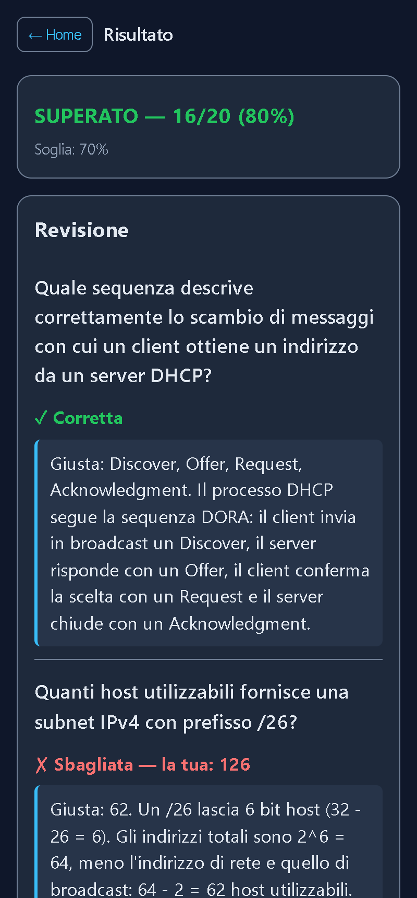
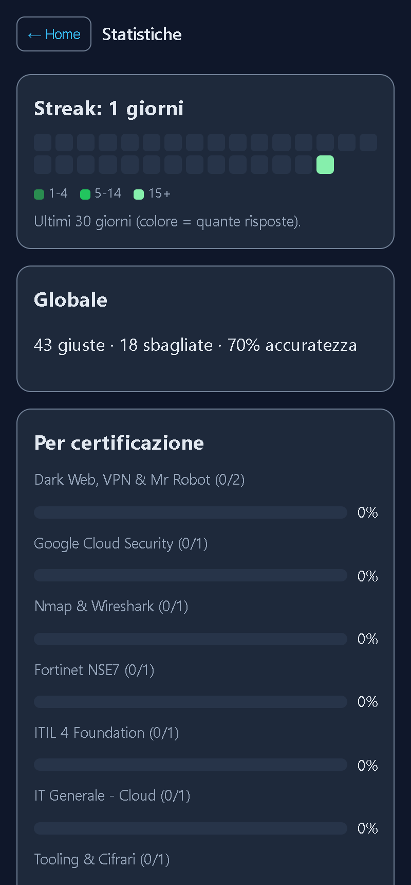
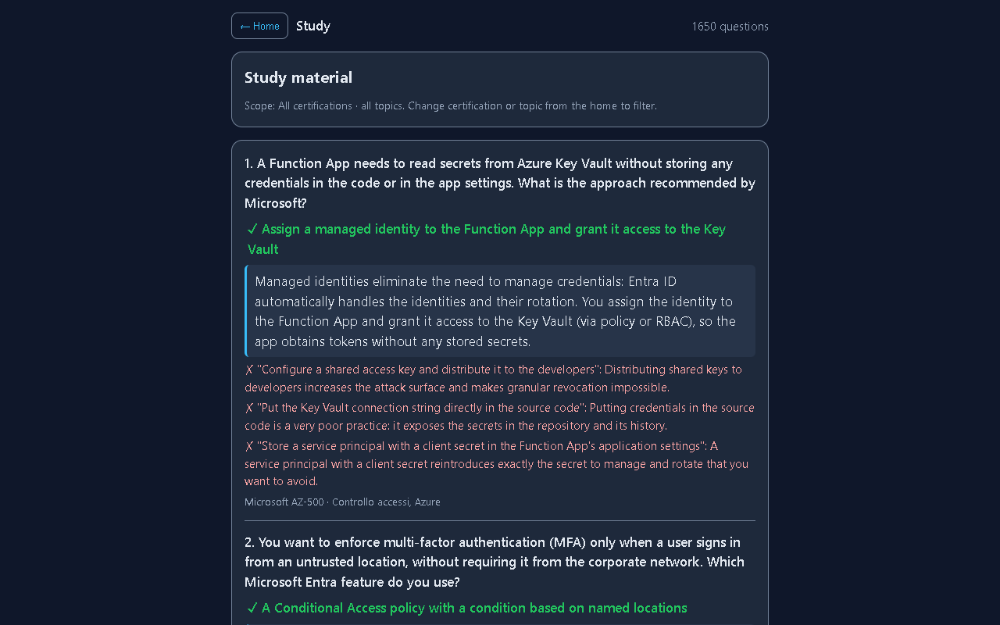

# QuizCert

[](https://github.com/Kashim0-afk/QUIZCERT/actions/workflows/ci.yml)
[](LICENSE)

Offline-first quiz app (PWA) for reviewing IT, cybersecurity and networking certification
topics: CCNA, CompTIA Security+ / Network+, CEH, Microsoft AZ-900 / SC-900, ITIL 4, Fortinet
and more. **1650 original questions in Italian and English**, instant feedback with an
explanation of every wrong option, timed exam simulation, mistake review, daily challenge and
study statistics. Vanilla JavaScript, no framework, no runtime dependencies.

**Live demo: <https://kashim0-afk.github.io/QUIZCERT/>** (installable on desktop and Android,
works offline after the first visit)

🇮🇹 [Riassunto in italiano](#in-italiano)

## Screenshots

| Home | Training with feedback | Timed exam |
|:---:|:---:|:---:|
|  |  |  |

| Exam result and review | Statistics | Study mode (English, desktop) |
|:---:|:---:|:---:|
|  |  |  |

Screenshots are captures of the real app served locally, taken with headless Chrome.

## Features

- **Training**: sessions of 10, 20 or 50 questions with instant feedback: right/wrong, why the
  chosen option is wrong, and the explanation.
- **Exam simulation**: 10/20/40 questions, 5 to 40 minutes, pass mark 70%, full review at the
  end. The countdown is based on an absolute deadline, so it keeps running in background tabs;
  when time runs out the selected answer is still recorded.
- **Mistake review**: only the questions you got wrong and have not yet answered right twice in
  a row.
- **Daily challenge**: the same 15 questions for everyone on a given day; it feeds the streak and
  counts once per day (it can be replayed without being recorded again).
- **Study**: read every question with its right answer and explanations, no quiz.
- **Answer options are shuffled every time** a question is shown, so the position of the right
  answer is never a hint (true/false keeps the Vero/Falso order).
- Filter by **certification**, by **topic** across certifications, or mix everything.
- **Italian / English** toggle (UI and questions); the page `lang` follows the toggle.
- **Statistics**: streak, 30-day calendar, accuracy overall, per certification and per topic
  (weakest first). **Export / import** of your progress as JSON, with strict validation of the
  imported file.
- **Offline PWA** with a "New version available – Update" prompt when a new release is
  deployed.
- **Accessibility**: real radio/checkbox inputs, verdicts announced to screen readers (live
  region), focus moved to the new content on every screen change, visible focus, WCAG AA text
  contrast and non-text contrast of at least 3:1.

## Question bank

**1650 questions** in 43 areas: 1025 single choice, 330 multiple choice, 295 true/false. Every
question has an Italian and an English version, an explanation and, for multiple-choice
questions, the reason each wrong option is wrong.

| Area | Questions | Area | Questions |
|---|---:|---|---:|
| CCNA | 59 | CompTIA Security+ | 59 |
| CEH | 56 | CompTIA Network+ | 56 |
| Fortinet NSE4 | 52 | Palo Alto Networks | 51 |
| Google Cybersecurity | 50 | Microsoft AZ-900 | 49 |
| Microsoft MD-102 | 49 | Microsoft SC-900 | 49 |
| IBM Cybersecurity | 48 | ITIL 4 Foundation | 46 |
| Dark Web, VPN & Mr Robot | 40 | Google AI Essentials | 40 |
| Tooling & Cifrari | 40 | Cisco CyberOps Associate | 34 |
| CompTIA CySA+ | 34 | CompTIA PenTest+ | 34 |
| ISO 27001 | 34 | LPIC-1 | 34 |
| Microsoft AZ-500 | 34 | Microsoft MS-102 | 34 |
| Microsoft SC-300 | 34 | IT Generale - Hardware (A+) | 34 |
| IT Generale - Linux | 34 | IT Generale - Windows | 34 |
| Glossario Cybersecurity | 33 | IT Generale - Virtualizzazione | 33 |
| IT Generale - Active Directory | 32 | IT Generale - Cloud | 32 |
| IT Generale - Database | 32 | IT Generale - Scripting | 32 |
| Analisi Forense | 31 | Blockchain e Crittografia | 31 |
| Fortinet NSE6 | 31 | Fortinet NSE7 | 31 |
| IT Generale - Backup e DR | 31 | IT Generale - Help Desk | 31 |
| Nmap & Wireshark | 31 | Sicurezza Web | 31 |
| Fortinet NSE5 | 30 | Google Cloud Security | 30 |
| Network Defense | 30 | | |

30 to 60 questions per area are meant for **review and self-assessment**, not as complete exam
preparation: real exams have 60 to 90 items and follow the vendor's current exam objectives,
which change over time (for example, Fortinet has replaced the NSE levels with the
FCA/FCP/FCSS program).

## Run locally

The app is static files. It needs to be served over HTTP (opening `index.html` from disk does
not work because browsers block loading the question files over `file://`).

```bash
python -m http.server 8000     # then open http://localhost:8000
```

On Windows you can double-click `Avvia-QuizCert.bat`, which does the same and opens the
browser.

Development needs only [Node.js](https://nodejs.org/) (LTS), no `npm install`:

```bash
npm test            # unit tests (node --test) + question bank integrity checks
npm run build:sw    # regenerate service-worker.js after changing any app or question file
npm run check:sw    # fail if service-worker.js is out of date (run in CI)
```

### Project structure

```
index.html                 app shell (CSP, manifest, icons)
style.css                  styles
src/main.js                boot: load questions, open IndexedDB, register the service worker
src/ui.js                  rendering (DOM only, text via textContent)
src/session.js             pure session logic: option shuffling, dates, daily challenge,
                           exam timer and scoring, study/stats helpers
src/engine.js              grading
src/select.js              filtering and random selection
src/stats.js               progress model, streak, accuracy
src/storage.js             IndexedDB store, export and strictly validated import
src/data-loader.js         loads data/manifest.json and the question files, validates them
src/schema.js              question validator
src/i18n.js                IT/EN dictionary and per-question localization
data/manifest.json         list of question files
data/questions/*.json      question bank
scripts/build-sw.mjs       service worker generator (Node built-ins only)
scripts/sw-template.js     service worker template
test/                      unit tests (node --test)
.github/workflows/ci.yml   CI: tests + service worker check on Node LTS
```

### How updates reach installed apps

`service-worker.js` is generated by `scripts/build-sw.mjs`. The precache list comes from the
app files and `data/manifest.json`, and the cache version is a SHA-256 hash of all of them, so
any change produces a new worker. Files are precached bypassing the HTTP cache, old caches are
deleted on activation, and the page shows a "New version available – Update" banner when a new
worker is waiting. CI fails if the committed `service-worker.js` does not match the files.

## Add questions

1. Create a JSON file in `data/questions/` containing an array of questions (see any existing
   file), or add questions to an existing file.
2. If it is a new file, add its path to `data/manifest.json` (`files` list).
3. Run `npm test`: every question is validated, ids must be unique across files, English
   options must match the Italian ones in number, and Italian text must use proper accents
   (`è`, `più`, `perché`, not `e'`, `piu`, `perche`).
4. Run `npm run build:sw` and commit the result together with the questions.

Question schema:

```json
{
  "id": "nse4-fw-012",
  "cert": ["Fortinet NSE4"],
  "topics": ["Firewall Policy", "NAT"],
  "type": "single",
  "difficulty": 2,
  "question": "Testo della domanda",
  "options": ["A", "B", "C", "D"],
  "correct": [0],
  "explanation": "Perché la risposta giusta è giusta.",
  "why_wrong": { "1": "Perché B è sbagliata" },
  "source": "…",
  "question_en": "Question text",
  "options_en": ["A", "B", "C", "D"],
  "explanation_en": "Why the right answer is right.",
  "why_wrong_en": { "1": "Why B is wrong" }
}
```

- `type`: `single` (one correct), `multi` (several correct), `truefalse` (options
  `["Vero", "Falso"]`, one correct).
- `correct`: 0-based indices of the right options (an array even with one answer). Options are
  shuffled at runtime, so their order in the file does not matter.
- `*_en` fields are optional; the Italian text is used when they are missing.
- Invalid questions are skipped at load time and the app shows a warning.

## Deploy

GitHub Pages serves the `main` branch root. Run the tests and `npm run build:sw` before pushing;
installed apps then show the update prompt.

## Your data

Progress is stored only on your device (IndexedDB); nothing is sent anywhere. Use
**Statistics → Export** to download `quizcert-stats.json` and **Import** to restore it on
another device or after clearing browser data.

## Disclaimer

QuizCert is an independent, personal study project. It is **not affiliated with, endorsed by or
sponsored by** CompTIA, Cisco, EC-Council, ISC2, Microsoft, Google, IBM, Fortinet, Palo Alto
Networks, PeopleCert/AXELOS (ITIL), ISO, the Linux Professional Institute or any other
certification body or vendor. Certification and product names are trademarks of their
respective owners and are used only to identify the topics covered.

The questions are **original**, written for study purposes (with AI assistance) from public
documentation and study notes. They are not real exam questions and are not taken from exam
dumps. The `source` field records the topic or study material a question relates to, not an
exam item. If you believe some content infringes your rights, please open an issue.

## License

[MIT](LICENSE) © 2026 Matteo Zordan

---

## In italiano

**QuizCert** è una PWA per ripassare certificazioni IT, cybersecurity e networking con quiz a
risposta multipla "stile patente": 1650 domande originali in italiano e inglese, feedback
immediato con la spiegazione di ogni opzione sbagliata, simulazione d'esame a tempo, ripasso
errori, sfida giornaliera, modalità studio e statistiche. Funziona offline e si installa come app.

- **Demo:** <https://kashim0-afk.github.io/QUIZCERT/>
- **Avvio in locale:** `python -m http.server 8000` e poi <http://localhost:8000>, oppure
  doppio click su `Avvia-QuizCert.bat`.
- **Test:** `npm test` (serve solo Node.js LTS, nessuna dipendenza da installare).
- **Aggiungere domande:** aggiungi il file in `data/questions/` e in `data/manifest.json`, esegui
  `npm test`, poi `npm run build:sw` e committa anche `service-worker.js`. Chi ha l'app
  installata vedrà l'avviso "Nuova versione disponibile – Aggiorna".
- **Backup dei progressi:** Statistiche → Esporta / Importa.

Progetto indipendente, non affiliato a CompTIA, Cisco, EC-Council, ISC2, Microsoft né ad altri
enti di certificazione. I nomi delle certificazioni sono marchi dei rispettivi proprietari. Le
domande sono originali e servono allo studio: non sono domande d'esame reali.
